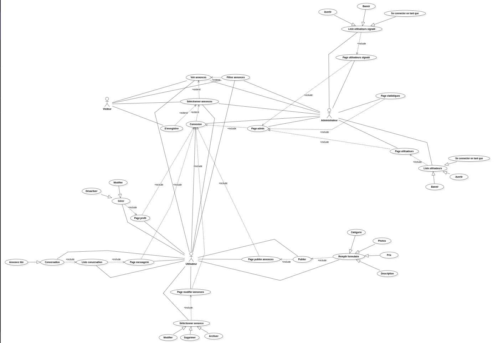

# Vencose.nc — Application Web

Projet réalisé dans le cadre du BTS SIO (Services Informatiques aux Organisations).  
Vencose.nc est une application web de vente en ligne (particuliers à particuliers), conçu pour mon examen de BTS SIO (SLAM).

---

## Liens du projet

- **Tableau Kanban (suivi des tâches)** : [GitHub Projects](https://github.com/users/kibagami-nc/projects/4)
- **Maquettes Figma** : [Vencose.nc — Design](https://www.figma.com/site/jzYelDeQAQlzcwf4nUKlYx/BOUILLE_Manley_VencoseNC?node-id=0-1&t=Y5bY7yGDNFI88zfR-1)

---

## Diagramme de cas d'utilisation



---

## Stack technique

| Couche | Technologie                     |
|-----------|---------------------------------|
| Front-end | Angular                         |
| Back-end | Java 17 — Spring Boot (Maven)   |
| Base de données | PostgreSQL                      |

## Outils
| Nom      | Utilisation        |
|----------|--------------------|
| DBeaver  | Base de données    |
| [MailHog](https://github.com/mailhog/MailHog)  | Serveur smtp local |

```bash
docker run -d \
  --name mailhog \
  -p 1025:1025 \
  -p 8025:8025 \
  mailhog/mailhog
```
---

## Installation et lancement

### Prérequis

- Node.js et Angular CLI installés
- JDK 17
- Maven
- PostgreSQL

### Cloner le dépôt

```bash
git clone https://github.com/kibagami-nc/BOUILLE_Manley_Projet_Web_VencoseNC.git
cd BOUILLE_Manley_Projet_Web_VencoseNC
```

### Lancer le back-end

```bash
cd backend
mvn spring-boot:run
```

### Lancer le front-end (se mettre dans le dossier 'webapp')

```bash
cd frontend
npm install
npm start
```

L'application sera accessible à l'adresse `http://localhost:4200`.

---

## Auteur

Projet réalisé par [kibagami-nc](https://github.com/kibagami-nc) dans le cadre du BTS SIO.
